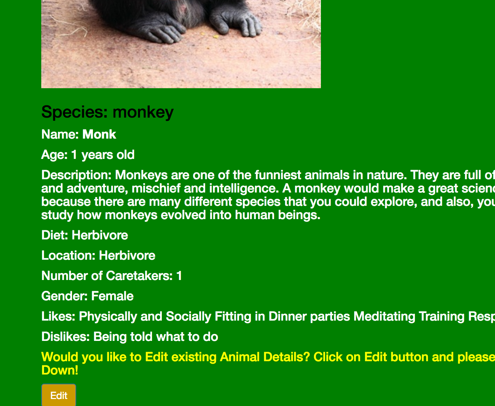
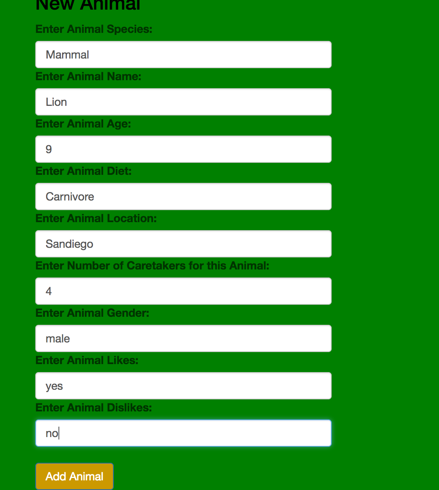
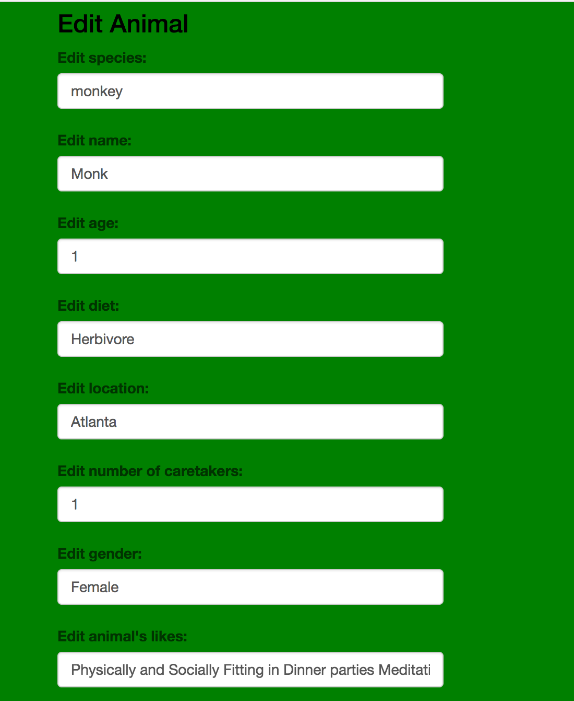
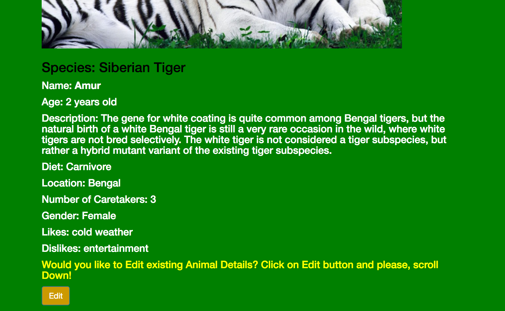
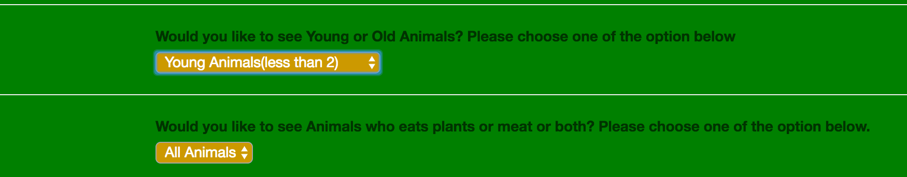
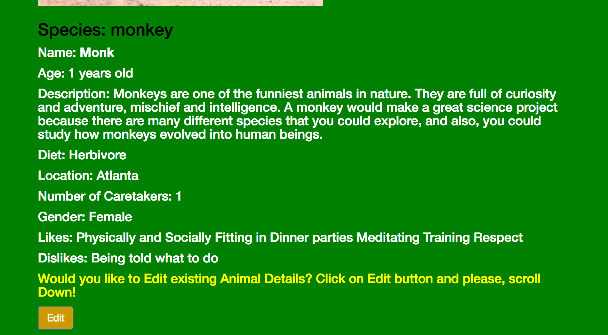

# Local Zoo API Website JavaScript/Angular week-three Project

#### Local Zoo API Application, September 22 2017

#### By Shyamal Punekar

## Description

_An application toto track animals at your local Zoo.._

## Setup/Installation Requirements
* Clone the repo
* navigate to  project root folder
* run in terminal $ npm install
* run in terminal $ bower install
* run in terminal $ gulp build
* Launch Index.html

## Specifications

| Behavior      | Input | Output |
| ------------- | ------------- | ------------- |
| User able to log a newly-admitted animal by submitting a form with animal species, name, age, diet, zoo location, number of needed caretakers, sex, one like and one dislike | | | |
| A user able to view a list of animals I have logged | | | |
| User may view all animals, only young animals (less than 2 years of age), or only mature animals (2 years of age and older)|  |  |
| A user able to click an animal to edit its name, age or caretakers. | | | |

# Screenshots

## Display animal List

## Add a new animal to the zoo

## The ability to edit form, e.g. monkey

## Animal Details after editing the edit form

## Sort by the animals diet e.g. select Meat

## Sort by the animals age. e.g Select young(less than 2)

# Setup
  https://github.com/shyamalpunekar/zoo-Angular-app

# Support and contact details

  Please feel free to contact shyamal.punekar@gmail.com if you have any questions, issues, concerns, comments or suggestions.
# Known Bugs
_There are no known bugs at this time!_

## Technologies Used

* JavaScript/TypeScript
* atom
* html/css
* AngularJS

### License

_Permission is hereby granted, free of charge, to any person obtaining a copy of this software and associated documentation files (the "Software"), to deal in the Software without restriction, including without limitation the rights to use, copy, modify, merge, publish, distribute, sublicense, and/or sell copies of the Software, and to permit persons to whom the Software is furnished to do so, subject to the following conditions:

The above copyright notice and this permission notice shall be included in all copies or substantial portions of the Software.

Copyright &copy; 2017 Shyamal Punekar
